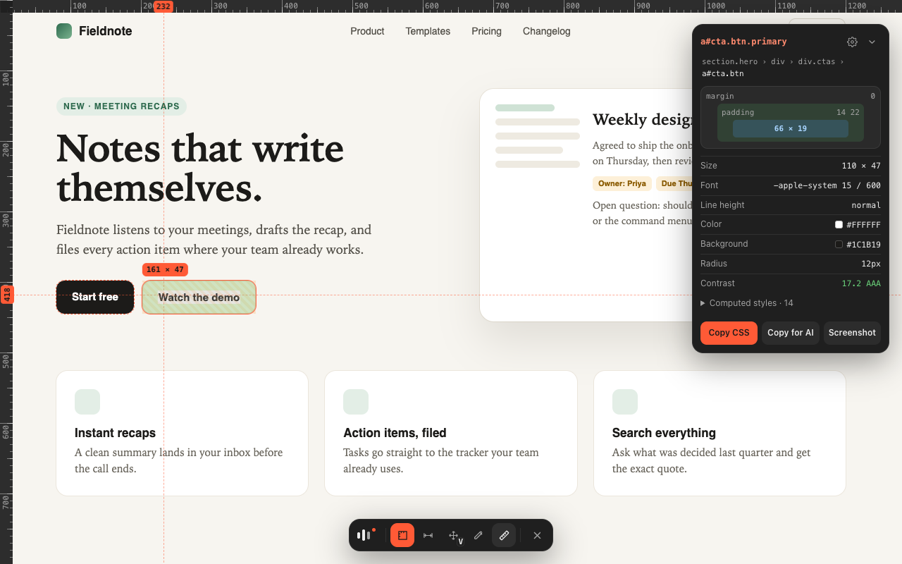

# lidar

<p>
  <a href="https://github.com/vanisov/lidar/actions/workflows/ci.yml"></a>
  <a href="LICENSE"></a>
  
  <a href="https://github.com/vanisov/lidar/releases/latest"></a>
</p>

Precision inspection for the web. Free, forever.

<p></p>

Lidar measures and inspects anything on a web page: sizes, spacing, distances, colors, and computed CSS. It's a
free, open-source alternative to paid inspector extensions, and a sibling of [Sonar](https://github.com/vanisov/sonar).

## Use

| | |
|---|---|
| Open / close | Click the toolbar icon, press `⌥L` on a Mac or `Alt+L` elsewhere, or right-click → **Inspect with Lidar**. `Esc` closes. |
| Measure | Hover anything. Click to pin it. |
| Distance | Pin an element, then hold `⌥` (Mac) or `Alt` and hover another. |
| Spread | Press `S` (or hold `⇧`) and lines run from the cursor to the nearest edge each way. Press `S` again to switch between **Visual** (stops at what you see) and **Layout** (stops at element boxes). |
| Rulers | Numbered every 100px (or whole rems), with the cursor's position marked on both rulers. |
| Layout | Hover a flex or grid container to see its tracks, gaps and line numbers. Breakpoints are marked on the top ruler. |
| Find | Press `/` and type a CSS selector. `↑` `↓` step through matches, `Enter` pins one. |
| Navigate | `↑` parent · `↓` first child · `←` `→` siblings |
| Tools | `M` measure · `D` distance · `S` spread · `C` color picker · `R` rulers · `G` column grid · `X` X-ray · `/` find |
| Copy | Click any value. **Copy CSS**, **Copy for AI**, **Screenshot** in the panel. |

## Privacy

No analytics, no network requests, no host permissions. See [PRIVACY.md](PRIVACY.md).

## Build from source

```bash
npm install
npm run build          # dist/ — load it at chrome://extensions with "Load unpacked"
npm test               # unit tests
npm run e2e            # end-to-end tests against the real extension
npm run package        # lidar.zip for the Chrome Web Store
```

## Contributing

Issues and PRs are welcome. Read [CONTRIBUTING.md](CONTRIBUTING.md) first; releases are described in
[docs/RELEASING.md](docs/RELEASING.md).

## License

MIT
